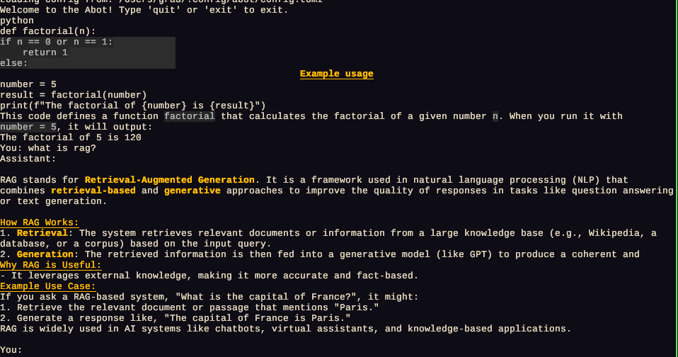

# abot -- another, ai, agent bot
CLI chatbot, written in Rust and very fast, support markdown output and use DeepSeek v3 by default. 

## Features
- Fast and responsive CLI interface
- Render to markdown for code blocks and formatting
- Streaming responses

## Installation

### From git directly

```bash
cargo install --git https://github.com/mvccn/abot
```
it will be installed to your cargo bin directory, default is ~/.cargo/bin. 

### From source

```bash
git clone https://github.com/mvccn/abot.git
cd abot
cargo build --release
```
### Do not forget to add your own api key

```bash
echo "DEEPSEEK_API_KEY=your-api-key-here" >> .env
```
or add one line to ~/.config/abot/config.toml, this file will be created when you run abot for the first time.
```toml
api_key = "your-api-key-here"
```

## Demo

