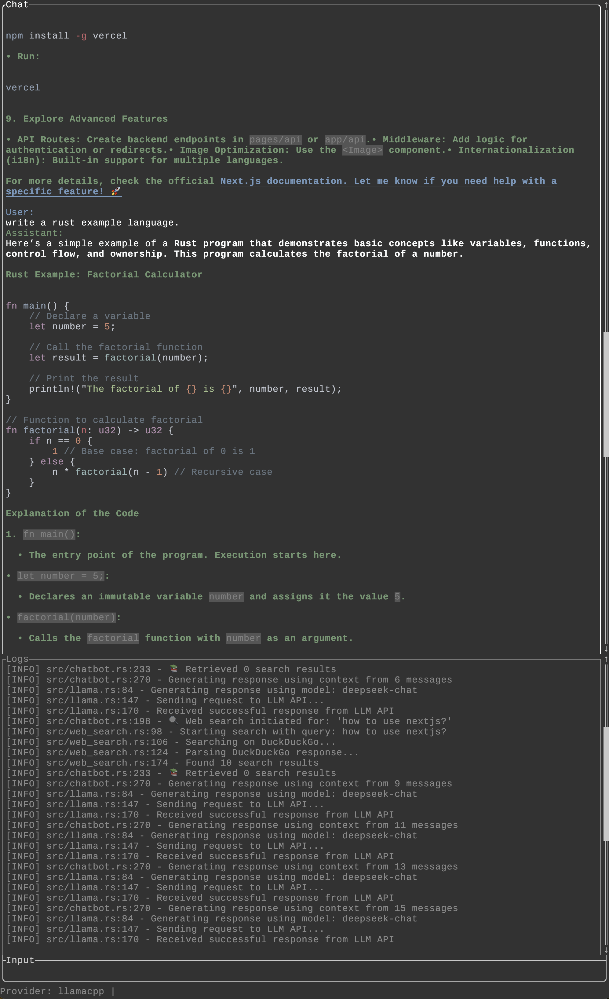

# abot -- another/ai/agent bot
CLI chatbot, written in Rust and very fast, support markdown output and use DeepSeek v3 by default. 

## New release: TUI app
new tui branch is available, the new abot is a fast terminal ui chatbot app with beautiful markdown and code syntax highlighting rendering in terminal.

## Features
- Fast and responsive CLI interface
- Render to markdown for code blocks and formatting
- Streaming responses
- save/saveall:
     save last conversation or save all the conversation by /save or /saveall
- search web:
    search web by add @web in your message

## Installation

### From git directly

```bash
cargo install --git https://github.com/mvccn/abot
```
it will be installed to your cargo bin directory, default is ~/.cargo/bin. 

### From source

```bash
git clone https://github.com/mvccn/abot.git
cd abot
cargo build --release
```
### Do not forget to add your own api key

```bash
echo "DEEPSEEK_API_KEY=your-api-key-here" >> .env
```
or add one line to ~/.config/abot/config.toml, this file will be created when you run abot for the first time.
```toml
api_key = "your-api-key-here"
```

## Demo


## TUI App



## How to use

```bash
abot tui
```
type and chat.
up/down or page up/down to navigate the conversation.
tab to logs section.

### commands: 
- /model modelname: to switch model, default is deepseek, you can use other model like gpt-4o, claude-3-5-sonnet-20240620. 
    - you will need to have them configured in your ~/.config/abot/config.toml file.
    - switch to the model by /model modelname, where modelname is the name of the model configuration in the config.toml file.
- /log debug|info: set log level to debug or info
- /save: save last conversation
- /saveall: save all the conversation
- /raw: show raw output
- /exit: exit the app
- @web: search web by add @web in your message